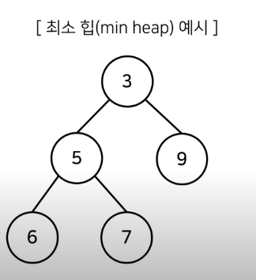

## 힙

- (가장 꼭대기의 노드를 제거)
- 완전 이진트리 자료구조의 일종
- 힙에서는 항상 루트 노드(root node)를 제거 합니다.
- 최소 힙(min heap)
    - 루트 노드가 가장 작은 값을 가집니다.
    - 값이 가장 작은 데이터가 우선적으로 제거됩니다.
- 최대 힙(max heap)
    - 루트 노드가 가장 큰 값을 가집니다.
    - 값이 가장 큰 데이터가 우선적으로 제거됩니다.
- **Min-Heapify()** 데이터를 넣었을 때 heap의 성질을 가지도록 하려면, (상향식) 부모 노드로 거슬러 올라가며, 부모보다 자신의 값이 더 작은 경우 위치를 교체하는 방식으로 진행해야 함.
    - 새로운 원소가 삽입되었을 때 O(logN)의 시간복잡도로 힙 성질을 유지하도록 할 수 있음.
    - 원소가 제거될 때도 최악의 경우 O(logN)의 시간복잡도로 힙 성질을 유지할 수 있음.
        - 원소를 제거할 때는 가장 마지막 노드가 루트 노드 위치에 오도록 함.
        - 이후에 루트 노드에서부터 하향식으로(더 작은 자식 노드로) Heapify()를 진행합니다.  

## 완전 이진트리(Complete Binary Tree)

- 루트 노드부터 시작하여 왼쪽 자식노드, 오른쪽 자식 노드 순서대로 데이터가 차례대로 삽입되는 tree를 의미함.

## 우선순위 큐

- 우선순위 큐 : 우선 순위가 가장 높은 데이터를 가장 먼저 삭제하는 자료구조
- 데이터를 우선순위에 따라 처리하고 싶을 때 사용
- ex. 물건 데이터를 자료 구조에 넣었다가 가치가 높은 물건부터 꺼내서 확인해야 하는 경우

### 구현 방법
 
- 단순히 리스트 이용하여 구현
- 힙(heap)을 이용하여 구현
