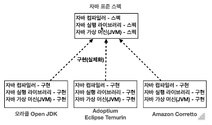
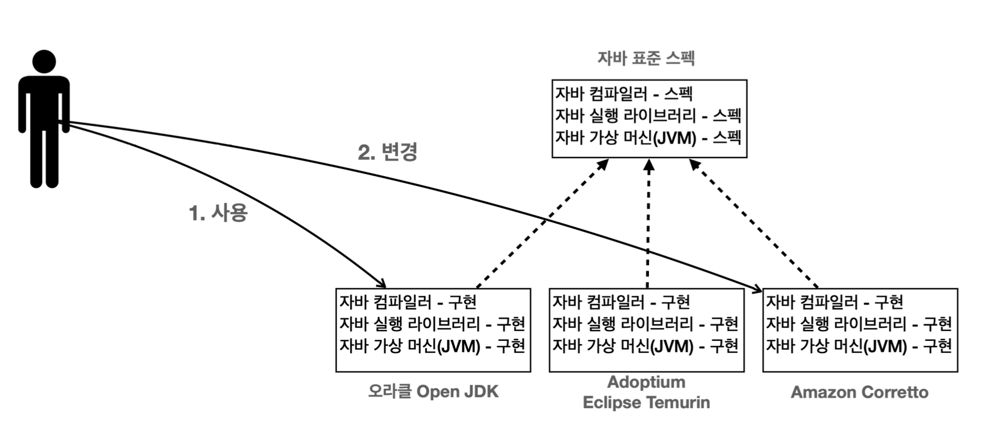
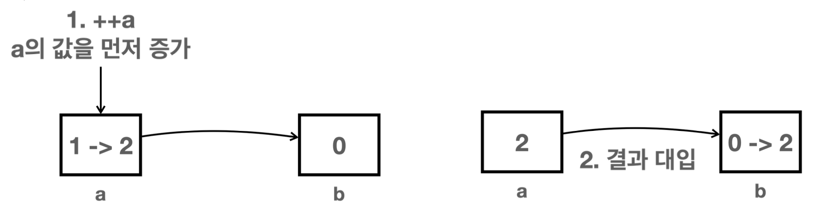
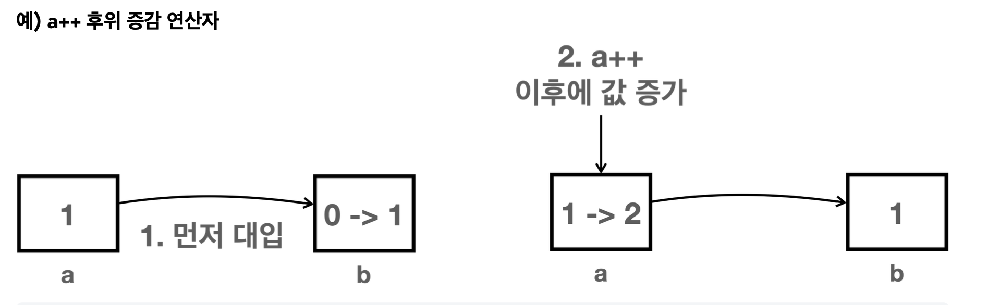
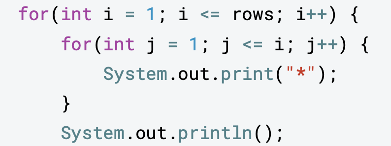
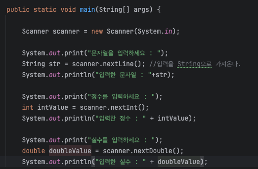
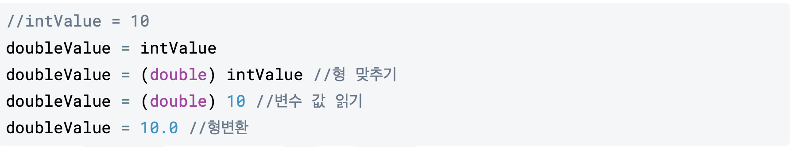
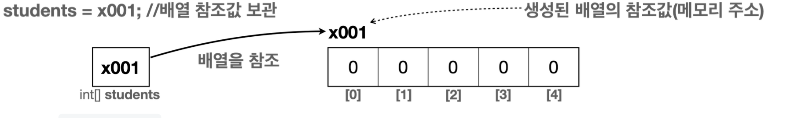

# 왜 자바인가?
- 백앤드
- 프론트앤드
- 안드로이드
<br/>

# 실무에 필요한 자바 배우기
- 코드와 예제를 통해 자연스럽게 이해하기
- 문제와 풀이
- 기본기 탄탄한 개발자 만들기
<br/>
<br/>

# 개발 환경 설정
## 인텔리제이 vs 이클립스
- 자바 프로그램 개발시 인텔리제이 혹은 이클립스 툴을 많이 사용한다. (최근에는 빠른 속도와 사용 편의성 때문에 인텔리제이를 주로 사용함)
- 자바로 개발하는 대부분의 메이저 회사들도 최근에는 인텔리제이를 주로 사용하므로 인텔리제이로 학습

- 자바로 개발하는 대부분의 메이저 회사들은 mac 사용
- SDK? :
<br/>

### public class HELLO JAVA
- HelloJava를 클래스라 한다. 클래스의 개념을 이해해야 학습할 수 있음.
- 파일명과 클래스 이름이 같아야 한다.
- {} 블록을 사용해서 클래스의 시작과 끝을 나타낸다.
<br/>

### public static void main(String[] args)
- main 메서드
- 자바는 main(String[] args) 메서드를 찾아서 프로그램을 시작한다. (프로그램의 시작점)
<br/>

### System.out.println("hello java");
- System.out.println() : 값을 콘솔에 출력하는 기능이다.
- 자바는 ;으로 문장을 구분한다. 문장이 끝나면 세미콜론을 필수로 넣어주어야 한다.

- 중괄호로 감싸는 것 : Block 이라고 함
- {}를 이용해 코드를 쉽게 구분하고 이해하도록 함.
- 들여쓰기를 해야함. (블록이 시작되고 끝날 떄 마다 들여쓰기가 적용되어 있는 것을 확인할 수 있음.)
- 들여쓰기를 하지 않아도 프로그램은 동작하나, 코드를 읽기에 좋지 않다.
- 프로그램은 main()을 시작으로 위에서 한 줄 씩 실행된다.
<br/>

### 주석(Comment)
- 한 줄 주석(single line comment)
    - // 기호로 시작하낟. 이 기호 이후의 모든 텍스트는 주석으로 처리 된다.
- 여러 줄 주석 (multi line comment)
    - /* 으로 시작하고 */로 끝난다. 사이의 모든 텍스트는 주석으로 처리된다.
<br/>
<br/>

# 자바란?
## 자바 표준 스펙
- 표준 스펙과 구현 두 가지로 나눠져 있음.
- 
- 자바는 이렇게 만들어야 한다는 설계도이며, 문서이다.
- 표준 스펙을 기반으로 여러 회사에서 실제 작동하는 자바를 만든다.
- 자바 표준 스펙은 자바 커뮤니티 프로세스 (JCP)를 통해 관리된다.
<br/>

## 자바 구현
- 여러 회사에서 자바 표준 스펙에 맞추어 실제 작동하는 자바 프로그램을 개발한다.
- 각각 장단점이 있다. 예를 들어 amazon corretto 는 AWS 에 최적화 되어 있다.
- 각 회사들은 윈도우, MAC, 리눅스 같이 다양한 OS 에서 작동하는 버전의 자바도 함께 제공한다.

- 자바 구현에 대해서는 아래 사이트를 참고하자. 
https://whichjdk.com/ko

- 
- 자바 구현들은 모두 표준 스펙에 맞도록 개발되어 있다. 따라서 오라클 Open JDK를 사용하다가 Amazon Corretto 자바로 변경해도 대부분 문제 없이 동작한다.
<br/>

## 자바 컴파일과 실행
- Hello.java 와 같은 자바 소스코드를 개발자가 작성한다.
- 자바 컴파일러를 사용해서 소스 코드를 컴파일한다. 
    - 자바가 제공하는 Javac라는 프로그램을 사용한다.
    - .java -> .class 파일이 생성된다.
    - 자바 소스 코드를 바이트 코드로 변환하며 자바 가상 머신에서 더 빠르게 실행될 수 있게 최적화하고 문법 오류도 검출한다.
- 자바 프로그램을 실행한다.
    - 자바가 제공하는 java 라는 프로그램을 사용한다.
    - 자바 가상 머신(JVM)이 실행되면서 프로그램이 작동한다.

- 자바 프로그램은 자바가 설치된 모든 OS 에서 실행할 수 있다.
- 자바 개발자는 특정 OS 에 맞추어 개발을 하지 않아도 된다. 자바 개발자는 자바에 맞추어 개발하면 된다.
- 호환성 문제는 자바가 해결한다
- 윈도우 자바는 윈도우 OS 가 사용하는 명령어들로 구성되어 있다.

- 개발할 떄 자바와 서버에서 실행할 떄 다른 자바를 사용할 수 있다.
- 개발자들은 개발의 편의를 위해서 윈도우나 MAC OS를 주로 사용한다.
- 서버는 주로 리눅스를 사용한다. 만약 AWS를 사용한다면 Amazon Corretto 자바를 AWS 리눅스 서버에 설치하면 된다.
- 자바의 운영체제 독립성 덕분에 각각의 환경에 맞추어 자바를 설치하는 것이 가능하다.

<br/>
<br/>

# 변수
## 패키지
- 패키지는 자바 파일을 구분하기 위한 폴더로 이해하면 된다.
- variable 이라는 패키지를 만들었다면, 해당 패키지에 들어가는 자바 파일 첫 줄에 package variable;과 같이 소속된 패키지를 선언해 주어야 한다.
- 자바 파일이 위치하는 패키지와 package variable 선언 위치가 같아야 한다.(패키지 이름이 같아야 함.)

- String은 첫 글자가 대문자로 시작하는 특별한 타입이다. 뒤에 클래스를 배워야 자세히 이해할 수 있음.
- 문자열을 다루는 특별한 타입이라고 이해하면 된다.
<br/>

## 리터럴
- 코드에서 개발자가 직접 적은 고정된 값을 프로그래밍 용어로 리터럴(literal) 이라고 한다.
- 변수의 값은 변할 수 있지만, 리터럴은 개발자가 직접 입력한 고정된 값이다. 따라서 리터럴 자체는 변하지 않는다.

- 정수 리터럴은 int를 기본으로 사용한다. 만약 숫자가 int 범위인 약 20억을 넘어가면 L을 붙여서 정수 리터럴을 long으로 변경해야 한다. (소문자 l은 숫자1과 착각할 수 있어서 권장하지 않는다.)
- 실수 리터럴은 double을 기본으로 사용한다.
<br/>

## 변수 타입 정리
- byte, short, float, char 등은 주로 잘 사용하지 않는다.
- 메모리 용량을 약간 절약하기 보다는 개발속도나 효율에 초점을 맞추는 것이 더 효과적이다.
<br/>

## 변수 명명 규칙
- 변수 이름은 숫자로 시작할 수 없다.
    - 그러나 숫자를 이름에 포함하는 것은 가능하다.
- 이름에는 공백이 들어갈 수 없다.
- 자바의 예약어를 이름으로 사용할 수 없다. (int, class, public)
- 변수 이름에는 영문자, 숫자, 달러기호, 밑줄만 사용할 수 있다.

- 관례
    - 소문자로 시작하는 낙타 표기법
    - 여러 단어로 이루어진 변수의 경우, 첫 번째 단어는 소문자로 시작하고 그 이후의 단어는 대문자로 시작하는 낙타 표기법을 사용한다.
    - 클래스는 대문자로 시작, 나머지는 소문자로 시작
    - 추가로 낙타 표기법 적용하기
    - 상수는 모두 대문자를 사용하고, 언더바로 구분한다.
    - 패키지는 모두 소문자를 사용한다.
<br/>
<br/>

# 연산자
## 산술 연산자
### 연산자 종류
- 산술
- 증감 : ++, --
- 비교
- 논리
- 대입
- 삼항 연산자 : ? , :

- 주의 ! 0으로 나누기
    - 10 / 0 과 같이 숫자는 0으로 나눌 수 없다.
    - 0으로 나누면 프로그램 오류 발생한다.


- 전위, 후위 증감연산자
    - ++a : 증감연산자를 피연산자 앞에 둘 수 있다. 이것을 앞에 있다고 해서 전위(Prefix) 증감 연산자라고 한다.
    - a++ : 증감연산자를 피연산자 뒤에 둘 수 있다. 이것을 뒤에 있다고 해서 후위(Posfix) 증감 연산자라고 한다.

- 전위증감 연산자


- 후위증감 연산자


- 증감 연산자를 단독으로 사용하는 경우, 다른 연산이 없기 때문에 본인의 값만 증가한다. 따라서 전위이든 후위이든 둘 다 결과가 같다.

- 비트 연산자는 실무에서 거의 사용할 일이 없다. 필요할 때 찾아보자. 
- 문자열이 같은지를 비교할 떄는 ==가 아니라 .equals() 메서드를 이용해야 한다.
<br/>
<br/>

# 조건문
## if, else
- 특정 조건에 따라서 다른 코드를 실행하는 것
- 조건문에는 if문, switch 문이 있다. 둘 다 특정 조건에 따라서 다른 코드를 실행하는 것이라 생각하면 된다.
- if문은 특정 조건이 참인지 확인하고, 그 조건이 참(true)일 경우 특정 코드 블록을 실행한다.

```java
if (condition) {
    //조건이 참일 때 실행되는 코드
}
```

- if code 블럭의 소괄호 사이가 false 가 되면 문장이 실행되지 않는다.
<br/>

## else
- if 문에서 만족하는 조건이 없을 때 실행하는 코드를 제공한다.

```java
if (condition) {
    // 조건이 참일 때 실행되는 코드
}
else {
    // 만족하는 조건이 없을 때 실행되는 코드
}
```
<br/>

## elseif
- python의 elif 같은 것
- if 문으로 코드를 짜게 되면 -> 모든 조건을 검사하게 됨.
    - 단점이 존재한다. 
    - 불필요한 조건 검사 : 이미 조건을 만족해도 불필요한 다음 조건을 계속 검색한다. 
    - 코드 효율성 : 조건을 중복 체크 하게 됨
-  ele if 문은 앞선 If 문의 조건이 거짓일 때 다음 조건을 검사한다. 만약 앞선 if문이 참이라면 else if를 실행하지 않는다.
- 앞에서 이미 검증된 부분에 대해 조건을 검사할 필요가 없다.
<br/>

## If 문과 else if 문
- if 문에 else if 를 함께 사용하는 것은 서로 연관된 조건일 때 사용한다. 서로 관련 없는 독립 조건이면 else if 를 사용하지 않고 if 문을 가각 따로 사용해야 한다.
- if-else 사용 : 서로 연관된 조건이어서, 하나로 묶을 때
- if의 각각 사용 : 독립조건일 때
<br/>

## Switch 문
- 예시) 회원 등급에 따라 다른 쿠폰을 발급하는 프로그램을 작성해야 한다.
- switch문은 앞서 배운 if문을 조금 더 편리하게 사용할 수 있는 기능이다.
- if 문은 비교 연산자를 사용할 수 있지만, switch 문은 단순히 값이 같은지만 비교할 수 있다.
```java
switch(조건식) {
    case value1:
        //조건식의 결과 값이 value1일 때 실행되는 코드
        break;
    case value2:
        //조건식의 결과 값이 value2일 때 실행되는 코드
        break;
    default:
        //조건식의 결과 값이 위의 어떤 값에도 해당되지 않을 때 실행되는 코드
}
```
- if vs switch 문
    - switch 문의 조건식을 넣는 부분을 잘 보면 x > 10과 같은 참 거짓의 결과가 나오는 조건이 아니라 단순히 값만 넣을 수 있다.
    - switch 문은 조건식이 특정 case와 같은지만 체크할 수 있다. 쉽게 이야기해서 값이 같은지 확인하는 연산만 가능하다. (문자도 가능)
    - 자바 14의 새로운 switch문
        - switch문은 if 문보다 조금 덜 복잡한 것 같지만, 그래도 코드가 기대보다 깔끔하게 나오지는 않는다. 이런 문제를 해결하고자 자바 14부터는 새로운 switch문이 정식 도입되었다.
        - 기존 switch 문과의 차이는 다음과 같다.
            - -> 를 사용한다.
            - 선택된 데이터를 반환할 수 있다.
<br/>
<br/>

## 삼항연산자
- 다항식 계산하는 항이 3개여서 3항연산자임.
- ? : 를 이용해서 조건을 만들어 줌.
``` java
String status = (age >= 18) ? "성인" : "미성년자";
System.out.println("age = " + age + "status = " + status);
```
- 조건이 참이면 성인, 거짓이면 미성년자가 들어가게 됨.
- 삼항 연산자는 항이 3개라는 뜻이다. 조건, 참, 표현식, 거짓_표현식 이렇게 항이 3개이다.
- 자바에서 유일하게 항이 3개인 연산자여서 삼항 연산자라고 한다. 또는 특정 조건에 따라 결과가 나오기 때문에 조건 연산자라고도 한다.


# 반복문
자바는 다음 3가지 종류의 반복문을 제공한다.
- while
- do-while
- for

## while
```java
while(조건식) { 
    //코드
}
```

while 문은 조건에 따라 코드를 반복해서 실행할 때 사용한다.
- 조건식을 확인한다. 참이면 코드 블럭을 실행하고, 거짓이면 while문을 벗어난다.
- 조건식이 참이면 코드 블럭을 실행한다. 이후에 코드 블럭이 끝나면 다시 조건식 검사로 돌아가서 조건식을 검사한다. (무한반복)

- 괄호 안 조건식 = True 가 되는 순간 계속 반복문이 진행됨
- 반복횟수 정하기 : i가 endNum이 될 때까지 반복해서 코드를 실행하면 된다.

## do-while
- do-while문은 while문과 비슷하지만, 조건에 상관없이 무조건 한 번은 코드를 실행한다.
```java
do {
    // 코드

}while (조건식);
```
- do에 적혀있는 코드는 무조건 한 번 실행하고 조건을 확인함.
- do-while문은 최초 한 번은 코드 블럭을 꼭 실행해야 하는 경우에 사용하면 된다.

## break & continue
- break는 반복문을 즉시 종료하고 나간다.
- continue는 반복문의 나머지 부분을 건너 뛰고 다음 반복으로 진행하는데 사용된다.
- 참고로 while, do-while, for와 같은 모든 반복문에서 사용할 수 있다.

```java
while(조건식) { 
    코드1;
    break; // 즉시 while문 종료로 이동한다.
    코드2;
}
//while문 종료
```

```java
while(조건식) { 
    코드1;
    continue; // 즉시 조건식으로 이동한다.
    코드2;
}
```
- continue를 만나게 되면 코드2가 실행되지 않고 다시 조건식으로 이동한다. 조건식이 참이면 while 문을 실행한다.


## for
for 문도 while문과 같은 반복문이고, 코드를 반복 실행하는 역할을 한다. for문은 주로 반복횟수가 정해져 있을 때 사용한다.
```java
for (1. 초기식; 2. 조건식; 4. 증감식) {
    // 3. 코든
}
```
다음 순서대로 실행된다.
1. 초기식이 실행된다. 주로 반복 횟수와 관련된 변수를 선언하고 초기화 할 때 사용한다. 초기식은 딱 1번 사용된다.
2. 조건식을 검증한다. 참이면 코드를 실행하고, 거짓이면 for문을 빠져나간다.
3. 코드를 실행한다.
4. 코드가 종료되면 증감식을 실행한다. 주로 초기식에 넣은 반복 횟수와 관련된 변수의 값을 증가할 때 사용한다.
5. 다시 2. 조건식부터 시작한다. (무한반복)

for문과 while문을 비교했을 때, for문이 더 깔끔하다는 느낌을 받을 수 있다. for문은 초기화, 조건 검사, 반복 후 작업 등이 규칙적으로 한 줄에 모두 들어 있어 코드를 이해하기 더 쉽다. 특히 반복을 위해 값이 증가하는 카운터 변수를 다른 부분과 명확하게 구분할 수 있다.

- for 문에서 초기식, 조건식, 증감식은 선택이다. 모두 생략해도 좋다.
- 단, 생략해도 각 영역을 구분하는 세미콜론(;)은 유지해야 한다.
- for문은 증가하는 값이 무엇인지, 초기식과 증감식을 통해서 쉽게 확인할 수 있다. 이 코드나 while 문을 보면 어떤 값이 반복에 사용되는 증가 값인지 즉시 확인하기는 어렵다.
- for문 없이 while 문으로도 모든 반복을 다룰 수 있다. 하지만 카운터 변수가 명확하거나 반복횟수가 정해진 경우 for문을 사용하는 것이 구조적으로 더 깔끔하고, 유지보수하기 좋다.

- for 문을 좀 더 편리하게 사용하도록 도와주는 향상된 for문 또는 for-each문으로 불리는 반복문도 있다. 이 부분은 뒤에서 설명한다.


## 중첩 반복문 
- java에서 print, println의 차이

- println()은 출력 후 다음 라인으로 넘어간다. 라인을 넘기지 않고 출력하려면 print()를 사용하면 된다.
- 두 번 이상의 중첩문은 잘 사용하지 않는다...

- 사용자가 특정 조건을 주었을 때 프로램을 종료해야되는 식의 반복문인 경우 -> for 문보다는 while 문을 쓰기도 한다.


# 훈련
## Scanner 학습
- 사용자의 입력을 받아서 그럴듯한 프로그램을 만들 수 있음.
- System.out을 이용해서 출력을 했듯이, System.in을 이용해서 사용자의 입력을 받을 수 있다.

- 이 코드는 객체-클래스로 이루어진 내용이다.
- Scanner의 기능을 사용하기 위해 new를 이용해서 Scanner를 만든다. -> 클래스를 통해 변수를 선언(객체 선언) 하고 scanner를 사용할 수 있다.
- Scanner.nextLine() : 엔터(\n)를 입력할 때 까지 문자를 가져온다.
- scanner.nextInt() : 입력을 int 형으로 가져온다. 정수 입력에 사용한다.
- scanner.nextdouble() : 입력을 double (실수) 형으로 가져온다. 실수 입력에 사용한다.
- 타입이 다르면 오류가 발생하기 때문에, 주의해주어야 한다.

# 스코프, 형 변환
## 지역변수와 스코프
- 변수는 선언한 위치에 따라 지역변수, 멤버변수(클래스변수, 인스턴스변수)와 같이 분류된다.
- 지역변수 : 특정 지역에서만 사용할 수 있는 변수이다.
    - 변수가 선언된 코드 블록 {}안에서만 생존하고, 선언된 코드 블록을 벗어나면 제거된다.

- 스코프(scope) : 변수의 접근 가능한 범위.
- 스코프 존재 이유
- 변수를 선언한 시점부터 변수를 계속 사용하지 않고, 왜 복잡하게 접근 범위(scope)라는 개념을 만들었을까?
```java
package scope;

public class Scope3_1 {
    public static void main(String[] args) {
        int m = 10;
        int temp = 0;
        if (m > 0){
            temp = m * 2;
            System.out.println("temp = " + temp);
        }
        System.out.println("m = " + m)
    }
}
```
- 임시변수 temp는 If 조건 만족시에만 임시로 사용하는 변수이다. 이때 아래와 같은 문제가 발생한다.
    - 비효율적인 메모리 사용
        - 코드 블록 종료시까지 메모리를 사용하기 때문에
    - 코드 복잡성 증가
        - if 코드 블록이 끝나도 main()어디서나 temp를 접근할 수 있다.
        - 좋은 코드는 군더더기 없는 단순한 코드임.
        - 스코프가 불필요하게 넓으면 좋지 않음.
        - 지금은 코드가 매우 단순해서 이해하는데 어려움이 없겠지만, 실무에서는 코드가 매우 복잡한 경우가 많다.
        - 좋은 프로그램은 무한한 자유가 있는 것이 아니라 적절한 제약이 있는 프로그램이다.

## 형변환
- 작은 범위에서 큰 범위로는 당연히 값을 넣을 수 있다.
- 큰 범위에서 작은 범위는 다음과 같은 문제가 발생할 수 있다.
    - 소수점 버림
    - 오버플로우
- 작은 범위에서 큰 범위로 대입은 허용한다.

**자동 형변환**
하지만 결국 대입하는 형(타입)을 맞춰야 하기 때문에 개념적으로는 아래와 같이 동작한다.

- 타입이 안맞는 경우 프로그램 상에서 강제로 맞춰준 것임!
- 큰 범위에서 작은 범위로의 대입은 명시적 형변환이 필요하다.

**명시적 형변환**
- 컴파일 오류는 문제를 가장 빨리 발견할 수 있는 좋은 오류이다.
- 손실이 발생할 수 있다.
- 영어로는 casting 이라고 한다. 개발자가 형변환 코드를 직접 입력한다고 해서 명시적 형변환이라고 한다.
- 형 변환을 한다고 해서 변수 자체의 타입이 변경되거나 그 안의 값이 변경되는 것은 아니고 변수로 부터 읽은 값을 형변환 하는 것이다.

**형변환 오버플로우**
- 형변환시 작은 숫자가 표현할 수 있는 범위를 넘어서면?
- 범위의 가장 작은 범위부터 다시시작하게 됨
- 넣을 때 보편적으로 형을 명시해줘야함.
- 기존 범위를 초과해서 표현하면 전혀 다른 숫자가 표현되는데, 이런 현상을 오버플로우라고 한다.
- 중요한 것은 오버플로우 발생 자체가 문제이며, 오버플로우가 발생했을 때 결과가 어떻게 되는지 계산하는데 시간을 낭비하면 안된다.

**계산**
- 같은 타입 끼리의 계산은 같은 타입의 결과를 낸다.
- 서로 다른 타입의 계산은 **큰 범위**로 자동 형변환이 일어난다.
<br/>
<br/>

# 배열
- 학생의 점수를 계산하는 프로그램을 생각할 때, 학생을 몇 명 더 추가하는 것은 개발자가 코딩으로 해결할 수 있겠지만, 학생을 수백명 이상 추가해야 한다면 코드가 상당히 많이 늘어날 것이다. -> 학생 수에 비례하여 코딩 양이 비례하는 문제가 발생
-  = 같은 타입의 변수를 사용하기 편하게 하나로 묶어둔 것.
- 배열을 사용하려면 int[] students; 와 같이 배열변수를 선언해야 한다.
- 일반적인 변수와 차이점은 int[] 처럼 타입 다음에 대괄호가 들어간다는 점이다.
- 배열변수를 선언한다고 해서 아직 사용할 수 있는 배열이 만들어진 것은 아니다.
    - 배열변수에는 10, 20과 같은 값이 아니라 배열 자체를 담을 수 있다.

- new int[5]로 배열을 생성하면 배열의 크기만큼 메모리를 확보한다.
- 배열을 생성하고 나면 자바는 메모리 어딘가에 있는 이 배열에 접근할 수 있는 참조값(주소)를 반환한다.

- 배열의 인덱스는 0부터 시작한다.
- 배열에 값을 대입하든, 배열의 값을 사용하든 간에 일반적인 변수와 사용법은 같다. 추가로 []를 통해 인덱스만 넣어주면 된다.
- 배열을 사용하면 참조값을 통해서 실제 배열에 접근하고, 인덱스를 통해서 원하는 요소를 찾는다.

## 기본형 vs 참조형
- 자바의 변수 데이터 타입을 가장 크게 보면 기본형과 참조형으로 분류할 수 있다.
- 사용하는 값을 직접 넣을 수 있는 기본형, 배열 변수와 같이 메모리의 참조값을 넣을 수 있는 참조형으로 분류할 수 있다.
    - 기본형(Primitive type) : int, long, double, boolean 처럼 변수에 사용할 값을 직접 넣을 수 있는 데이터 타입을 기본형이라고 한다.
    - 참조형(Reference type) : int[] students 와 같이 데이터에 접근하기 위한 참조를 저장하는 데이터 타입을 참조형이라고 한다. 뒤에서 학습하는 객체나 클래스를 담을 수 있는 변수들도 모두 참조형이다.
- 기본형은 모두 사이즈가 명확하게 정해져있다.
- 배열은 동적으로 사이즈를 변경할 수 있다.
```java
int size = 10000; //사용자가 입력한 값을 넣었다고 가정
new int[size]; // 이 코드가 실행되는 시점에 배열의 크기가 정해진다.
```
- 기본형은 선언과 동시에 사이즈가 정적으로 정해지지만, 참조형을 사용하면 동적으로 크기가 변해서 유연성을 제공할 수 있다.

## 배열 리팩토링
배열을 사용해서 코드를 단계별로 리팩토링하기
- 리팩토링 : 기존의 코드 기능은 유지하면서, 내부 구조를 개선하여 가독성을 높이고 유지 보수를 용이하게 하는 과정을 뜻한다. 중복을 제거하고, 복잡성을 줄이며, 이해하기 쉬운 코드로 만들기 위해 수행된다.
- len(배열) = 배열.length 값은 조회만 할 수 있고. 대입은 할 수 없다. 

## 2차원 배열
- 2차원 배열은 행과 열로 구성된다.
- arr[1][2]와 같이 사용되는데, 먼저 행 번호를 찾고, 그 다음에 열 번호를 찾으면 된다.
- 초기화 : 기존 배열처럼 2차원 배열도 편리하게 초기화 할 수 있다.
- for 문에서 배열의 길이 활용 : 배열의 길이가 달라지면 for 문에서 row < 2, col < 3과 같은 부분을 같이 변경해야 하므로 이 부분을 배열의 길이를 사용해서 변경한다.

## 향상된 for 문
- 향상된 for문 (Enhanced for loop)
- 각각의 요소를 탐색한다는 의미로 for-each 문이라고도 한다.
- 향상된 for문은 배열의 인덱스를 사용하지 않고, 종료 조건을 주지 않아도 된다. -> 단순히 배열을 처음부터 끝까지 탐색함
- 배열의 인덱스를 사용하지 않고도 배열의 요소를 순회할 수 있기 때문에 코드가 간려하고 가독성이 좋다.
- 향상된 for 문에는 증가하는 인덱스 값이 감추어져 있기 때문에, int i와 같은 증가하는 인덱스 값을 직접 사용해야 하는 경우에는 향상된 for문을 사용할 수 없다.